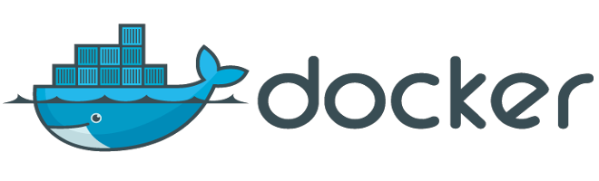
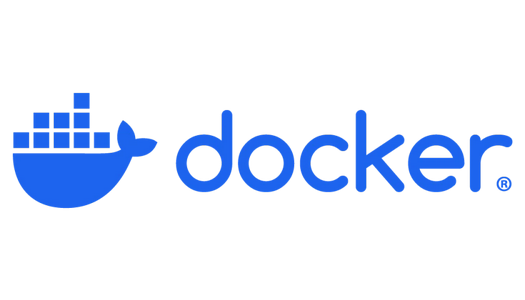

### Подробный план изучения Docker с Docker Desktop

<br>



<br>

Подробный план для практики и изучения Docker, включает теоретические основы, практические задания и рекомендации по использованию инструмента Docker Desktop на разных операционных системах в Windows, macOS и Linux. <br>
План обучения 3–4 недели при изучении материалов 2–3 часа в день, либо быстрее, если есть опыт работы с Linux или программированием. Рассчитан на пользователей с начальным уровнем знаний и охватывает установку, базовые концепции, практические задания, начиная с первичных навыков и заканчивая продвинутыми сценариями. 

### Особенности для разных ОС

**Windows** - для работы Docker Desktop в Windows используйте WSL2 для лучшей производительности, обязательно проверьте, что Hyper-V не конфликтует с другими гипервизорами (например, VirtualBox). <br>
**macOS** - Docker Desktop в macOS работает через встроенный гипервизор, что делает работу проще, но обратите внимание на лимиты ресурсов в настройках. <br>
**Linux** - Docker Desktop на Linux менее требователен, но требует ручной настройки, например, добавление пользователя в группу docker.

<br><hr>

#### 1. Введение в Docker и подготовка

**Цель (1–2 дня)**: *Понять, что такое Docker, его основные концепции и подготовить рабочую среду*.

1.1. **Изучение основ Docker**:
   - Прочитать, что такое Docker, контейнеры, образы, реестры (Docker Hub).
   - Ознакомиться с основными терминами: контейнер, образ, Dockerfile, Docker Compose.
   - Ресурсы:
       - Официальная документация Docker: [Get Started](https://docs.docker.com/get-started/).
       - Статья: [What is a Container?](https://www.docker.com/resources/what-container/).   

1.2. **Понимание Docker Desktop**:
   - Узнать, что такое Docker Desktop и его особенности для Windows, macOS и Linux.
   - Изучить системные требования для каждой ОС:
       - Windows: WSL2 или Hyper-V, 64-битная Windows 10/11 Pro, Enterprise или Education.
       - macOS: macOS 10.15 или новее, поддержка виртуализации.
       - Linux: Ubuntu, Debian, Fedora или другие поддерживаемые дистрибутивы.
   - Ресурсы: 
       - [Docker Desktop Overview](https://docs.docker.com/desktop/).

1.3. **Подготовка системы**:
   - Проверить системные требования (CPU с поддержкой виртуализации, минимум 4 ГБ RAM).
   - Включить виртуализацию в BIOS/UEFI (VT-x/AMD-V).
   - Для Windows: установить WSL2 (Windows Subsystem for Linux) и обновить ядро Linux.
   - Для Linux: убедиться, что ядро поддерживает контейнеры (обычно включено по умолчанию).

1.4. **Практическое задание**:
   - Установить браузер и текстовый редактор (VS Code, Sublime Text) для работы с кодом и документацией.
   - Зарегистрироваться на [Docker Hub](https://hub.docker.com/) для доступа к образам.

<br><hr>

#### 2. Установка Docker Desktop

**Цель (1 день)**: *Установить и настроить Docker Desktop на своей операционной системе*.

2.1. **Установка на Windows**:
   - Скачать установочный файл с [официального сайта](https://www.docker.com/products/docker-desktop).
   - Запустить установщик, выбрать WSL2 или Hyper-V в качестве бэкенда.
   - Установить WSL2, если он еще не настроен (команда: wsl --install).
   - Проверить установку: открыть PowerShell или CMD и выполнить `docker --version`.

2.2. **Установка на macOS**:
   - Скачать .dmg-файл с сайта Docker.
   - Перетащить приложение в папку Applications.
   - Запустить Docker Desktop и предоставить необходимые разрешения.
   - Проверить установку: открыть Terminal и выполнить `docker --version`.

2.3. **Установка на Linux**:
   - Следовать инструкциям для дистрибутива (например, Ubuntu, Fedora).
   - Установить Docker Engine и Docker Desktop через пакетный менеджер (apt/yum/dnf).
   - Пример для Ubuntu:
     ```bash
     sudo apt-get update
     sudo apt-get install docker-ce docker-ce-cli containerd.io docker-desktop
     ```
   - Настроить Docker для запуска без sudo (добавить пользователя в группу docker).
   - Проверить установку: `docker --version`.

2.4. **Запуск Docker Desktop**:
   - Открыть Docker Desktop и убедиться, что он работает (иконка в системном трее/панели).
   - Проверить статус Docker Daemon: `docker info`.

2.5. **Практическое задание**:
   - Установить Docker Desktop на своей ОС.
   - Выполнить команду `docker run hello-world` и убедиться, что контейнер запустился.
   - Исправить возможные ошибки (например, отсутствие прав или конфликты портов).

<br><hr>

#### 3. Основы работы с Docker

**Цель (3–5 дней)**: *Освоить базовые команды Docker, работу с образами и контейнерами*.

3.1. **Работа с командами Docker**:
   - Изучить основные команды:
     - `docker pull` — загрузка образа.
     - `docker run` — запуск контейнера.
     - `docker ps` — просмотр запущенных контейнеров.
     - `docker stop`/`docker rm` — остановка и удаление контейнеров.
     - `docker images`/`docker rmi` — просмотр и удаление образов.
   - Ресурсы: 
       - [Docker CLI Reference](https://docs.docker.com/engine/reference/commandline/cli/).

3.2. **Работа с Docker Hub**:
   - Найти образы на Docker Hub (например, nginx, mysql, python).
   - Загрузить образ: `docker pull nginx`.
   - Запустить контейнер: `docker run -d -p 8080:80 nginx`.

3.3. **Управление контейнерами**:
   - Научиться запускать контейнеры в фоновом режиме (-d).
   - Проброс портов (-p).
   - Передача переменных окружения (-e).
   - Просмотр логов: `docker logs <container_id>`.

3.4. **Практическое задание**:
   - Запустить контейнер с веб-сервером Nginx и открыть страницу в браузере (http://localhost:8080).
   - Запустить контейнер с Python и выполнить простую команду: `docker run python:3.9 python -c "print('Hello, Docker!')"`.
   - Остановить и удалить все контейнеры, очистить неиспользуемые образы (`docker system prune`).

<br><hr>

#### 4. Создание собственных образов с Dockerfile

**Цель (3–4 дня)**: *Научиться создавать и собирать собственные Docker-образы*.

4.1. **Изучение Dockerfile**:
   - Прочитать, что такое Dockerfile и его основные инструкции:
       - FROM — базовый образ.
       - RUN — выполнение команд при сборке.
       - COPY/ADD — копирование файлов.
       - CMD/ENTRYPOINT — команда по умолчанию при запуске контейнера.
       - EXPOSE — указание портов.
   - Ресурсы: 
       - [Dockerfile Reference](https://docs.docker.com/engine/reference/builder/).

4.2. **Создание простого приложения**:
   - Написать простое приложение (например, Python Flask или Node.js).
   - Пример для Python:
     ```
     from flask import Flask
     app = Flask(__name__)
     @app.route('/')
     def hello():
         return 'Hello from Docker!'
     if __name__ == '__main__':
         app.run(host='0.0.0.0', port=5000)
     ```

4.3. **Создание Dockerfile**:
   - Создать файл Dockerfile:
     ```dockerfile
     FROM python:3.9-slim
     WORKDIR /app
     COPY . .
     RUN pip install flask
     EXPOSE 5000
     CMD ["python", "app.py"]
     ```
   - Собрать образ: `docker build -t my-flask-app .`.
   - Запустить контейнер: `docker run -d -p 5000:5000 my-flask-app`.

4.4. **Практическое задание**:
   - Создать Dockerfile для собственного приложения (например, веб-сервер на Flask, Express.js или PHP).
   - Собрать и запустить образ, проверить доступность приложения в браузере.
   - Загрузить образ на Docker Hub: `docker push <your-username>/my-flask-app`.

<br><hr>

#### 5. Работа с Docker Compose

**Цель (3–4 дня)**: *Освоить оркестрацию нескольких контейнеров с помощью Docker Compose*.

5.1. **Изучение Docker Compose**:
   - Прочитать, что такое [Docker Compose](https://docs.docker.com/compose/) и его основные компоненты (сервисы, сети, тома).
   - Изучить структуру файла docker-compose.yml.
   - Ресурсы: 
       - [Docker Compose Overview](https://docs.docker.com/compose/install/).
       

5.2. **Создание многоконтейнерного приложения**:
   - Настроить приложение с несколькими сервисами, например:
       - Веб-сервер (Flask/Node.js).
       - База данных (PostgreSQL/MySQL).
       - Кэш (Redis).
   - Пример docker-compose.yml:
     ```yaml
     version: '3.8'
     services:
       web:
         build: .
         ports:
           - "5000:5000"
         depends_on:
           - db
       db:
         image: postgres:13
         environment:
           POSTGRES_USER: user
           POSTGRES_PASSWORD: password
           POSTGRES_DB: mydb
         volumes:
           - db-data:/var/lib/postgresql/data
       redis:
         image: redis:6
     volumes:
       db-data:
     ```

5.3. **Запуск и управление**:
   - Запустить приложение: `docker-compose up -d`.
   - Проверить статус: `docker-compose ps`.
   - Остановить и удалить: `docker-compose down`.

5.4. **Практическое задание**:
   - Создать docker-compose.yml для приложения с веб-сервером и базой данных.
   - Запустить приложение и проверить взаимодействие между сервисами.
   - Настроить тома для сохранения данных базы данных.

<br><hr>

#### 6. Продвинутые темы и оптимизация

**Цель (5–7 дней)**: *Освоить продвинутые возможности Docker и оптимизировать работу*.

6.1. **Работа с томами и сетями**:
   - Изучить типы томов: bind mounts, volumes, tmpfs.
   - Настроить пользовательские сети: `docker network create`.
   - Ресурсы: 
       - [Docker Storage](https://docs.docker.com/storage/), 
       - [Networking](https://docs.docker.com/network/).

6.2. **Оптимизация образов**:
   - Уменьшить размер образов:
       - Использовать многоступенчатую сборку (multi-stage builds).
       - Удалять ненужные файлы в Dockerfile.
   - Пример многоступенчатой сборки:
     ```dockerfile
     FROM node:16 AS builder
     WORKDIR /app
     COPY package.json .
     RUN npm install
     COPY . .
     RUN npm run build
     
     FROM node:16-slim
     WORKDIR /app
     COPY --from=builder /app/dist .
     CMD ["node", "index.js"]
     ```

6.3. **Мониторинг и отладка**:
   - Использовать `docker inspect` для анализа контейнеров.
   - Просматривать метрики через Docker Desktop (вкладка Dashboard).
   - Настроить логирование: docker logs и интеграция с внешними системами (например, ELK).

6.4. **Безопасность**:
   - Изучить лучшие практики: запуск контейнеров от имени не-root пользователя, ограничение ресурсов (--memory, --cpu).
   - Настроить секреты: `docker secret` или переменные окружения.

6.5. **Практическое задание**:
   - Настроить пользовательскую сеть и том для приложения.
   - Переписать Dockerfile с использованием многоступенчатой сборки.
   - Ограничить ресурсы контейнера (например, 512 МБ RAM).

<br><hr>

#### 7. Реальные сценарии и интеграция 

**Цель (5–7 дней)**: *Применить Docker в реальных проектах и изучить интеграцию с другими инструментами*.

7.1. **Развертывание CI/CD**:
   - Настроить автоматическую сборку образов в GitHub Actions или GitLab CI.
   - Пример для GitHub Actions:
     ```yaml
     name: Build and Push Docker Image
     on: [push]
     jobs:
       build:
         runs-on: ubuntu-latest
         steps:
           - uses: actions/checkout@v3
           - name: Build and push
             run: |
               docker login -u ${{ secrets.DOCKER_USERNAME }} -p ${{ secrets.DOCKER_PASSWORD }}
               docker build -t myapp:latest .
               docker push myapp:latest
     ```

7.2. **Интеграция с Kubernetes**:
   - Установить Minikube или Kind для локального тестирования Kubernetes.
   - Перенести приложение из Docker Compose в Kubernetes (создать манифесты для Deployment и Service).
   - Ресурсы: 
       - [Kubernetes Basics](https://kubernetes.io/docs/tutorials/).

7.3. **Тестирование и разработка**:
   - Настроить локальную среду разработки с Docker (hot-reload для Node.js/Flask).
   - Использовать Docker для тестирования (например, запуск тестов в контейнерах).

7.4. **Практическое задание**:
   - Настроить CI/CD для автоматической сборки и публикации образа.
   - Развернуть простое приложение в Minikube.
   - Настроить локальную разработку с автоматическим перезапуском контейнера.

<br><hr>

#### 8. Закрепление и проект

**Цель (5–10 дней)**: *Применить все знания в комплексном проекте*.

8.1. **Выбор проекта**:
   - Пример: веб-приложение (например, блог или интернет-магазин) с фронтендом, бэкендом и базой данных.
   - Использовать популярные технологии: React/Vue для фронтенда, Django/Flask/Node.js для бэкенда, PostgreSQL/MySQL для базы данных.

8.2. **Реализация**:
   - Создать Dockerfile для каждого сервиса.
   - Настроить docker-compose.yml для локальной разработки.
   - Оптимизировать образы и настроить тома/сети.
   - Развернуть приложение локально и проверить функциональность.

8.3. **Документация и улучшения**:
   - Написать README с инструкциями по запуску.
   - Добавить CI/CD для автоматической сборки.
   - Опционально: перенести приложение в Kubernetes.

8.4. **Практическое задание**:
   - Реализовать проект и опубликовать его на GitHub.
   - Загрузить образы на Docker Hub.
   - Подготовить краткую презентацию или видео с демонстрацией работы приложения.

<br><hr>

### Ресурсы обучения

  - Официальная документация Docker: [docs.docker.com](https://docs.docker.com/).  
  - Книги: [“Docker Deep Dive” by Nigel Poulton](https://github.com/stanislavfor/Docker-Deep-Dive), [“Learn Docker in a Month of Lunches” by Elton Stoneman](https://github.com/stanislavfor/learn-docker-in-a-month-of-lunches).
  
<br>



<br><hr><hr><hr><hr>

